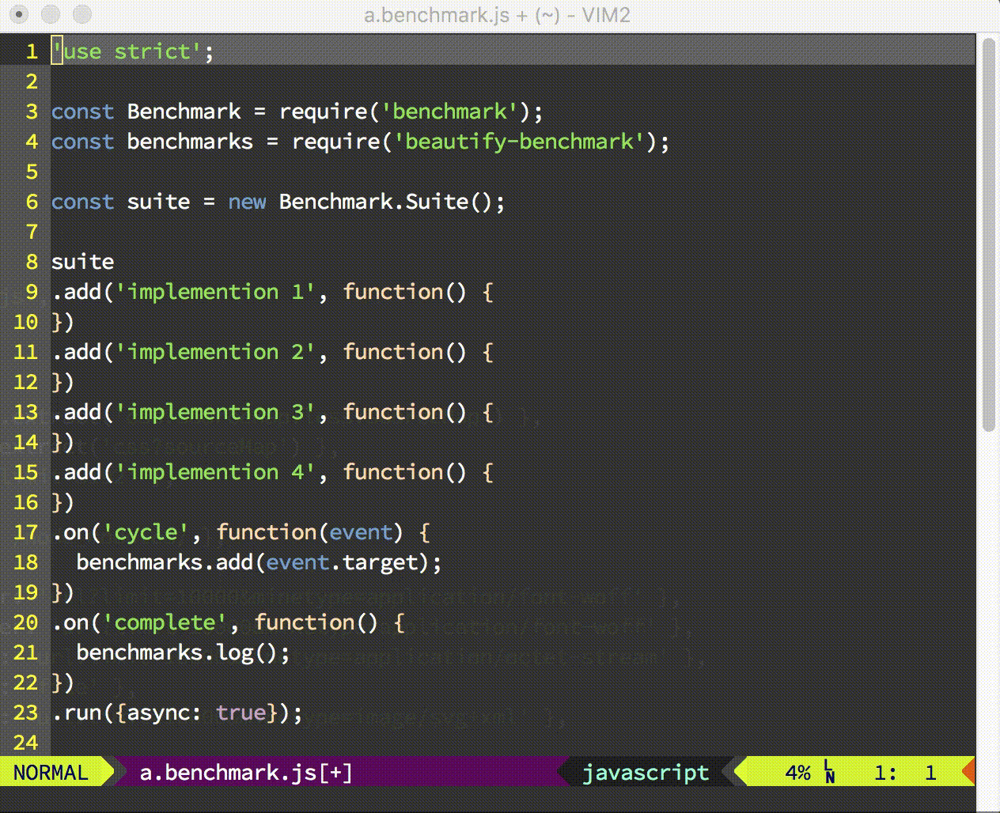

# README

Highlight variable name which under cursor.



## Install

Vundle:

```viml
Plugin 'hotoo/highlight-cursor-variable'

autocmd CursorMoved,CursorHold *.php,*.jsp silent! call HighlightCursorWord()
```

If you want highlight every filetypes, try:

```viml
autocmd CursorMoved,CursorHold * silent! call HighlightCursorWord()
```

Default support:

- *.js
- *.java
- *.cs
- *.c
- *.cpp
- *.h

want support more filetypes by default? Fork & Pull Request please.
